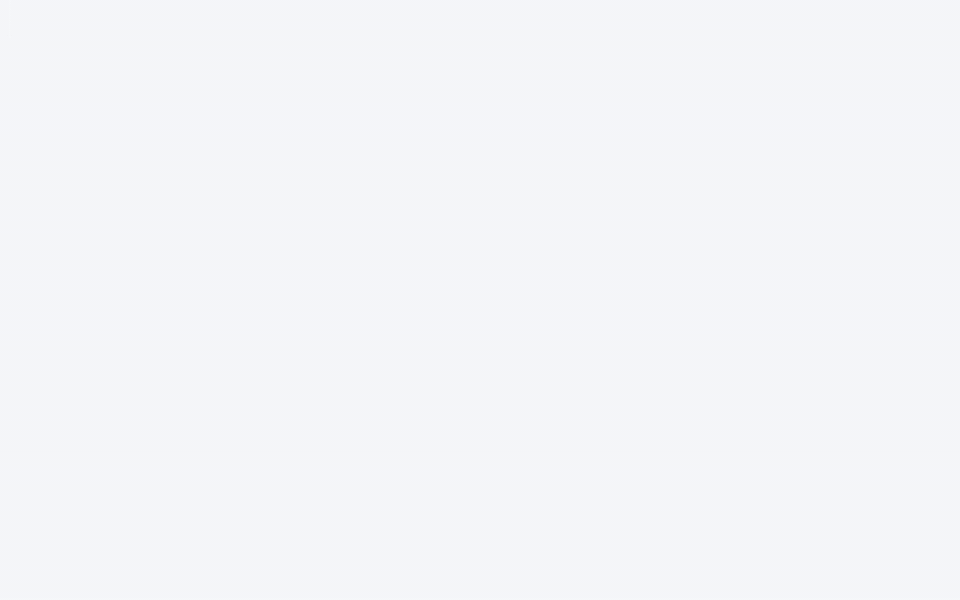
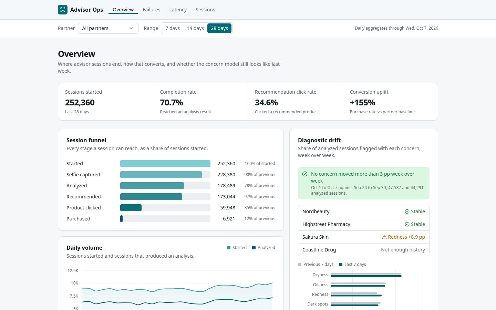
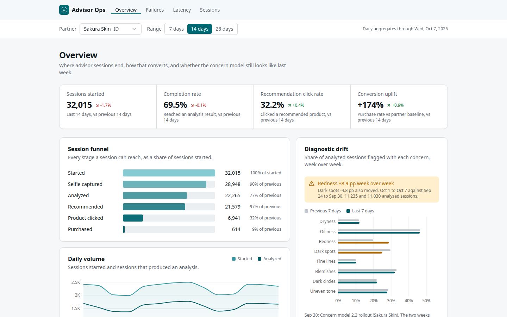
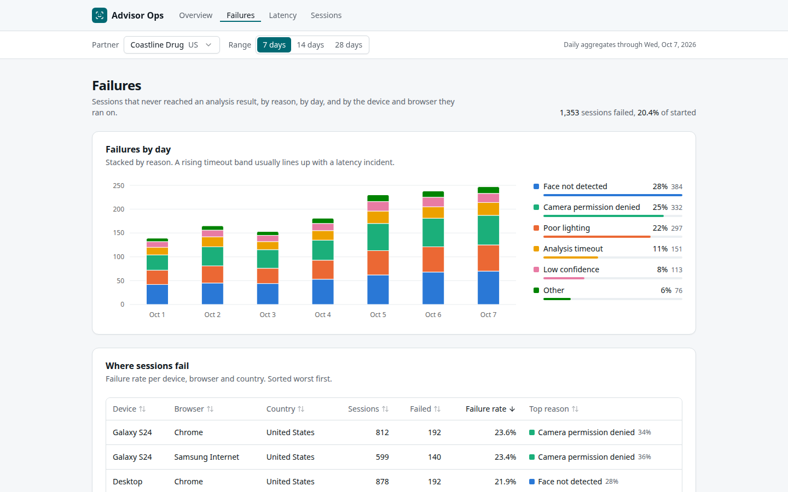
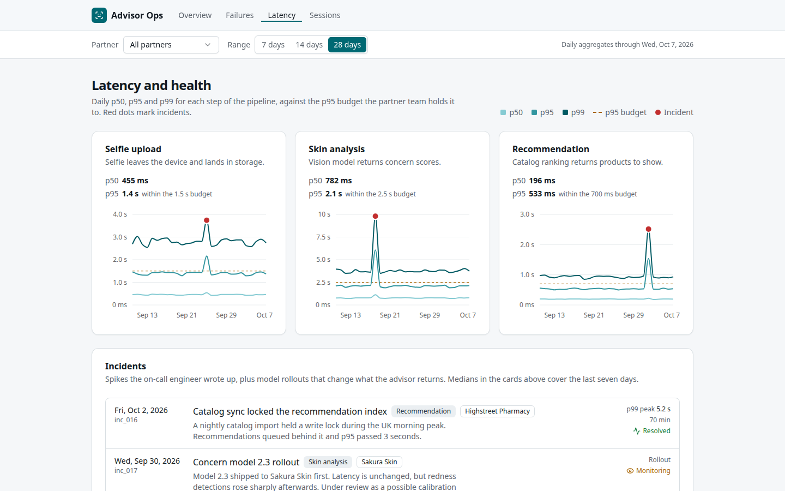
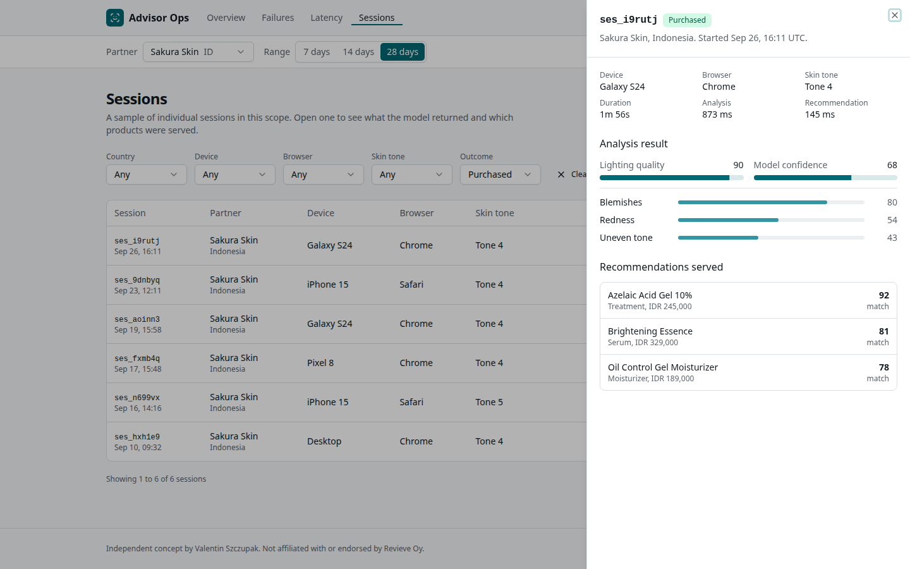

# Advisor Ops Console

An operations dashboard for an AI skin advisor: where sessions fail, how fast each step runs, and whether the model drifted this week.



Live demo: https://neomaking.github.io/skin-advisor-ops/

## Why

Revieve runs skin analysis and try-on advisors for over a hundred brands and retailers, and sells on outcome numbers like conversion uplift. When a partner's conversion dips, the questions are operational: which sessions never produced an analysis, on which devices, was it latency, or did a model release change what gets detected. This console is what a partner team would open every morning to answer that before the retailer asks.

## What's inside

- Four fictional partners (Denmark, UK, Indonesia, US), 28 days of daily aggregates for about 250k sessions, generated deterministically and parsed through Zod schemas that enforce funnel and percentile invariants.
- A session funnel with KPI deltas against the previous window; uplift is measured against each partner's own baseline.
- Diagnostic drift as an Effect service with typed failures: it compares concern shares week over week and refuses to compare a partner that lacks a full week of history.
- Failure reasons stacked by day, a sortable failure rate table per device, browser and country (TanStack Table), and p50/p95/p99 charts per step with incident markers (Recharts).
- A paginated session explorer with filters and a detail drawer showing the analysis and recommendations served, through tRPC running in the browser.

## Screenshots







## Run locally

```
npm install && npm run dev
```

## QA

- Last automated run (2026-10-09): typecheck, lint, unit tests (0 passed), build, Playwright e2e (1 passed), demo media. Design review score: 8/10.

```
npm run qa
```

Runs typecheck, Biome lint, Vitest, the Vite build, the Playwright walk and the media export. Unit tests cover the drift service (flagged shift, stable partner, insufficient history, empty scope), the funnel and failure aggregations, the generated data against the stated mix and latency baselines, axis tick rounding, and the KPI strip and sessions table components. The e2e opens each screen at 1440x900, checks the pooled and per-partner drift verdicts, sorts the failure table, counts incident markers, filters sessions and opens the detail drawer, saving a screenshot of each state.

## Notes

- A production version would read from a sessions warehouse with real percentile sketches per step, not daily rows weighted by volume.
- Drift needs a proper statistical test and per skin tone breakdowns before it can gate a model rollout.
- Partner scoped access and audit logging would come next, which is where gdp-ts proofs would be used.

Independent concept, not affiliated with or endorsed by Revieve Oy. No proprietary data was used. Built by [Valentin Szczupak](https://github.com/NeOMakinG).
